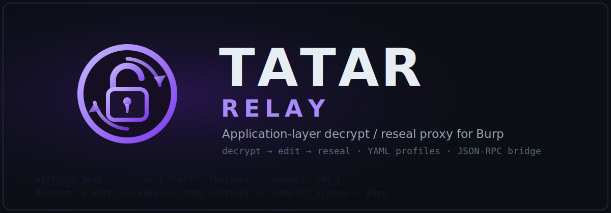
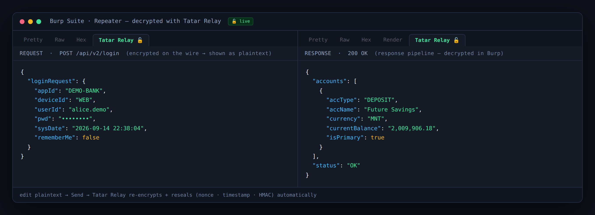
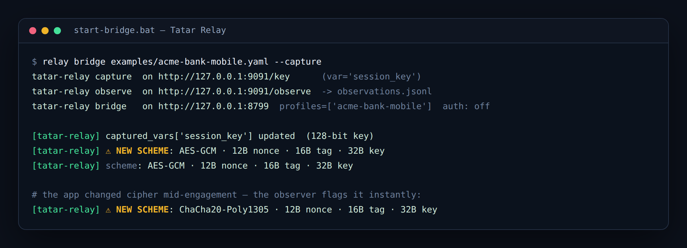

<p align="center">
  
</p>

# Tatar Relay

**Application-Layer Protocol Adaptation Layer** — work with encrypted APIs as if
they were plain HTTP, right inside Burp.

> Stop writing `decrypt.py → edit → encrypt.py` loops for every engagement.


<sub>Illustration — demo profile (`acme-bank-mobile`), synthetic data.</sub>

*[Монгол хувилбар доор байна ↓](#монгол)*

---

## English

Many apps add their own encryption layer *on top of* TLS: the body you see in
Burp is an opaque blob (`base64(gzip(aes(json)))`, a custom envelope, HMAC, …).
To test it today you drop out of Burp, run a `decrypt.py`, hand-edit the JSON,
run an `encrypt.py`, and rebuild the envelope by hand — for every target, every
engineer, every time.

Tatar Relay collapses that into **one reusable profile**. The bridge decrypts the
body to plaintext JSON automatically, you edit it like a normal request in Burp,
and it re-encrypts and re-seals (HMAC, nonce, timestamp) on the way out — for both
**requests and responses**.

> ⚠️ **Authorized testing only.** Do not use against systems you do not own or do
> not have explicit permission to test. Tatar Relay works with keys *you*
> legitimately hold for testing you are authorized to perform.

### Why not just X?

The pieces exist elsewhere — but the *integrated, config-first* version does not.

- **Hackvertor** does inline crypto in Burp, but per-request and tag-based — no
  reusable per-target profile, no live key capture, no cipher detection.
- **CyberChef** has the transforms, but it's not a proxy and isn't wired into the
  Burp intercept/Repeater flow.
- **Frida** hooks crypto at runtime, but you still hand-write the edit loop.

Tatar Relay's differentiator is the **combination**: a config-first profile +
reversible pipeline + reseal + live key capture + **cipher detection**, glued to
Burp. See [`docs/POSITIONING.md`](docs/POSITIONING.md).

> **"CyberChef's recipes meet Burp's Repeater — with live keys and cipher
> detection built in."**

### Install

```bash
git clone https://github.com/ochmunkh/Tatar-Relay
cd Tatar-Relay
pip install -e .            # add [mitmproxy] for the proxy frontend, [dev] for tests
```

### Quickstart (Burp)

```bash
# 1. start the bridge (auto-captures the session key)
relay bridge examples/acme-bank-mobile.yaml --capture
# 2. Burp → Extensions → Add → Java → burp/build/libs/tatar-relay-burp.jar
# 3. inject examples/js-hooks/session_key_capture.js, log in, then use the
#    "Tatar Relay 🔓" tab on request AND response in Repeater.
```

Full step-by-step (with troubleshooting): [`docs/QUICKSTART-MN.md`](docs/QUICKSTART-MN.md).

### Detect the cipher — "what encryption is this?"

When a target changes algorithm, you don't guess. The JS **crypto observer**
reports the exact scheme live, and flags it the moment it changes:


<sub>Illustration — demo output.</sub>

`relay inspect` fingerprints a captured blob (length %16, AEAD/nonce-prefix, ECB,
base64 variant, JSON field hints) and, merging any live observations, drafts a
profile for you to review:

```bash
relay inspect capture.bin --emit-profile draft.yaml --observations observations.jsonl
relay validate draft.yaml
```

### How it works — three phases

```
Wire body
  ①  Envelope   locate the payload, remember the rest        (structural)
  ②  Transform  base64 → gunzip → aes/chacha decrypt → json  (pure, reversible)
        … you edit the plaintext JSON in Burp …
  ②  Transform  encrypt → gzip → base64                      (runs in reverse)
  ①  Envelope   put the payload back
  ③  Reseal     set ts/nonce, recompute HMAC                 (integrity)
Wire body → server
```

- **Transform** steps are pure and reversible: `decrypt(encrypt(x)) == x`,
  enforced by the test suite.
- **Reseal** recomputes signatures. Re-serializing JSON can reorder keys and
  silently break an HMAC even with the right key, so serialize modes are
  explicit: `preserve` / `canonical` / `compact`.

### What it supports (v0.6)

- **Ciphers (native):** AES-CBC, AES-GCM, ChaCha20-Poly1305, **EVP_BytesToKey passphrase-mode**
  (`evp_aes_decrypt` — EVP_BytesToKey/MD5 KDF, `{ct,iv,s}` body format) — plus any scheme via
  a Python hook (ECDH+GCM, RSA-hybrid, …).
- **Codecs:** base64, hex, gzip, `nonce_body` (split a `hex-nonce + base64`
  field into raw `nonce‖ct`), and `strip_prefix` (peel a fixed IV / wrapping
  header off a blob) — no hook needed.
- **Integrity:** `hmac_verify` (SHA-1/256/512) forward; HMAC sign (SHA-256/512) on reseal.
- **Envelope:** raw / json_field / header (edits re-encrypt on the way out) / regex,
  plus **per-header sub-pipelines** — decrypt/edit/re-encrypt the body *and*
  independently-encrypted headers together (the "full symmetric envelope" class).
- **Frontends:** Burp (request + response tabs), mitmproxy addon, full CLI, JSON-RPC bridge
  (optional token auth, typed `--var` coercion: `str:` / `b64:` / `hex:` / bare = hex).
- **Detection:** live crypto observer + smart `inspect` with draft-profile output.
- **Target classes:** see [`docs/target-classes.md`](docs/target-classes.md) — field-wise AEAD,
  passphrase/KDF, and full symmetric envelope (body + encrypted headers) are all covered.

See [`CONTRACTS.md`](CONTRACTS.md) for the five frozen contracts and
[`docs/`](docs/) for the full guides.

### Security & Python hooks

When declarative YAML isn't enough, drop to Python — a hook is a user-written step
with the same `(data, ctx)` signature. But a community profile that ships Python is
arbitrary code execution: untrusted profiles must be **declarative-only** (the
loader refuses hooks unless `security.allow_python_hooks: true`). Scope is
**fail-closed** — a profile with no authorized hosts will not load.

### Development

```bash
pip install -e .[dev]
pytest            # 83 tests: unit + round-trip + golden regression
```

### Roadmap

- **v0.2** — Burp extension, request + response editor tabs, JS key capture.
- **v0.3** — native ChaCha20-Poly1305, `nonce_body` field codec.
- **v0.4** — crypto observer + smart `inspect` (draft profiles).
- **v0.5** — full symmetric envelope: encrypted-header sub-pipelines, header
  re-encrypt write-back, `strip_prefix` codec.
- **v0.6** — native `evp_aes_decrypt` (EVP_BytesToKey/MD5 passphrase mode); bridge typed
  var coercion (`str:` / `b64:` / `hex:`); Windows console Unicode fix.
- **next** — RSA/ECDH native derive, Intruder payload support, WebSocket, hook sandbox.

### License

MIT © 2026 [Enkhbat.O](https://www.facebook.com/enkhbat.o/) — Security Analyst

---

## Монгол

<p align="center">
  
</p>

Олон апп нь TLS **дээр нэмээд** өөрсдийн шифрлэлтийн давхарга үүсгэдэг: Burp дээр
харагдах body нь ойлгомжгүй blob (`base64(gzip(aes(json)))`, custom envelope,
HMAC …) байдаг. Үүнийг тестлэхийн тулд өнөөдөр Burp-ээ орхиж, `decrypt.py`
ажиллуулж, JSON-оо гараар засаж, `encrypt.py` ажиллуулж, envelope-оо гараар
угсардаг — target бүрт, engineer бүрт, удаа болгонд.

Tatar Relay үүнийг **нэг дахин ашиглагдах профайл** болгож хураадаг. Bridge нь
body-г автоматаар plaintext JSON болгож тайлж, чи Burp дотор энгийн request шиг
засаад, илгээхэд буцаагаад re-encrypt + reseal (HMAC, nonce, timestamp) хийдэг —
**request ба response** хоёуланд.

> ⚠️ **Зөвхөн зөвшөөрөлтэй тест.** Өөрийн эзэмшдэггүй, эсвэл тест хийх тодорхой
> зөвшөөрөлгүй систем дээр бүү ашигла.

### Яагаад өөр tool биш вэ?

Хэсэг бүр өөр газар байдаг — гэхдээ **нэгдсэн, config-first** хувилбар байхгүй.

- **Hackvertor** Burp дотор inline крипто хийдэг ч per-request, tag-төвтэй — target
  бүрт дахин ашиглагдах профайл, live key, cipher илрүүлэлт байхгүй.
- **CyberChef** transform-уудтай ч proxy биш, Burp урсгалд ороогүй.
- **Frida** runtime дээр hook хийдэг ч edit гогцоог гараар бичсэн хэвээр.

Ялгарах гол зүйл нь **хослол**: config-first profile + урвуутай pipeline + reseal +
live key capture + **cipher detection**, Burp-д наасан. [`docs/POSITIONING.md`](docs/POSITIONING.md)-г үз.

### Суулгах

```bash
git clone https://github.com/ochmunkh/Tatar-Relay
cd Tatar-Relay
pip install -e .
```

### Хурдан эхлэл (Burp)

```bash
# 1. bridge асаах (session key-г автоматаар барина)
relay bridge examples/acme-bank-mobile.yaml --capture
# 2. Burp → Extensions → Add → Java → burp/build/libs/tatar-relay-burp.jar
# 3. examples/js-hooks/session_key_capture.js-ээ тарь, нэвтэр, дараа нь Repeater
#    дээр request БА response-ийн "Tatar Relay 🔓" tab-ыг ашигла.
```

Алхам алхмаар (troubleshooting-той): [`docs/QUICKSTART-MN.md`](docs/QUICKSTART-MN.md).

### Шифрийг таних — "энэ ямар encryption вэ?"

Target алгоритм солиход таамаглахгүй. JS **crypto observer** нь схемийг бодитоор
хэлж, солигдвол шууд сэрэмжлүүлнэ. `relay inspect` нь blob-ыг таньж (урт %16,
AEAD/nonce-prefix, ECB, base64 variant, JSON талбарын дохио), live observation-ийг
нэгтгэж **draft profile** гаргана:

```bash
relay inspect capture.bin --emit-profile draft.yaml --observations observations.jsonl
relay validate draft.yaml
```

### Хэрхэн ажилладаг — гурван фаз

```
Wire body
  ①  Envelope   payload-ыг олж, үлдсэнийг санана          (бүтцийн)
  ②  Transform  base64 → gunzip → aes/chacha тайлах → json (цэвэр, урвуутай)
        … Burp дотор plaintext JSON-оо засна …
  ②  Transform  encrypt → gzip → base64                    (урвуугаар)
  ①  Envelope   payload-ыг буцааж тавина
  ③  Reseal     ts/nonce тавьж, HMAC дахин бодно           (integrity)
Wire body → server
```

Transform алхмууд цэвэр, урвуутай (`decrypt(encrypt(x)) == x`). Reseal нь гарын
үсгийг дахин бодно — JSON дахин serialize хийхэд key дараалал өөрчлөгдөж HMAC
эвдэрдэг тул горим тодорхой: `preserve` / `canonical` / `compact`.

### Юу дэмждэг вэ (v0.6)

- **Cipher (native):** AES-CBC, AES-GCM, ChaCha20-Poly1305, **EVP_BytesToKey passphrase-mode**
  (`evp_aes_decrypt` — EVP_BytesToKey/MD5 KDF, `{ct,iv,s}` формат) — мөн Python hook-оор
  аль ч scheme (ECDH+GCM, RSA-hybrid …).
- **Codec:** base64, hex, gzip, `nonce_body` (hex-nonce + base64 талбар), `strip_prefix`
  (тогтмол IV / wrapping угтвар салгах) — бүгд hook-гүйгээр.
- **Integrity:** `hmac_verify` (SHA-1/256/512); reseal HMAC sign (SHA-256/512).
- **Envelope:** raw / json_field / header (засвар гарахдаа дахин шифрлэгдэнэ) / regex,
  мөн **header тус бүрийн дэд-pipeline** — body БА тусад нь шифрлэгдсэн header-уудыг
  хамт задалж/засаж/дахин шифрлэнэ ("бүрэн симметрик envelope" ангилал).
- **Frontend:** Burp (request + response tab), mitmproxy addon, бүрэн CLI, JSON-RPC bridge
  (optional token, typed `--var`: `str:` / `b64:` / `hex:` / bare = hex).
- **Detection:** live crypto observer + ухаалаг `inspect` (draft profile).
- **Зорилтот ангилал:** [`docs/target-classes.md`](docs/target-classes.md) — field-wise AEAD,
  passphrase/KDF, бүрэн симметрик envelope (body + encrypted headers) бүгд хамрагдсан.

### Аюулгүй байдал

Declarative YAML хүрэлцэхгүй үед Python hook руу шилжинэ. Гэвч community профайл
Python агуулбал дурын код ажиллах эрсдэлтэй тул итгэмжлэгдээгүй профайл заавал
**declarative-only** (`allow_python_hooks: false` анхдагч). Scope нь **fail-closed** —
зөвшөөрөгдсөн host байхгүй профайл ачаалахгүй.

### Лиценз

MIT © 2026 [Enkhbat.O](https://www.facebook.com/enkhbat.o/) — Security Analyst
